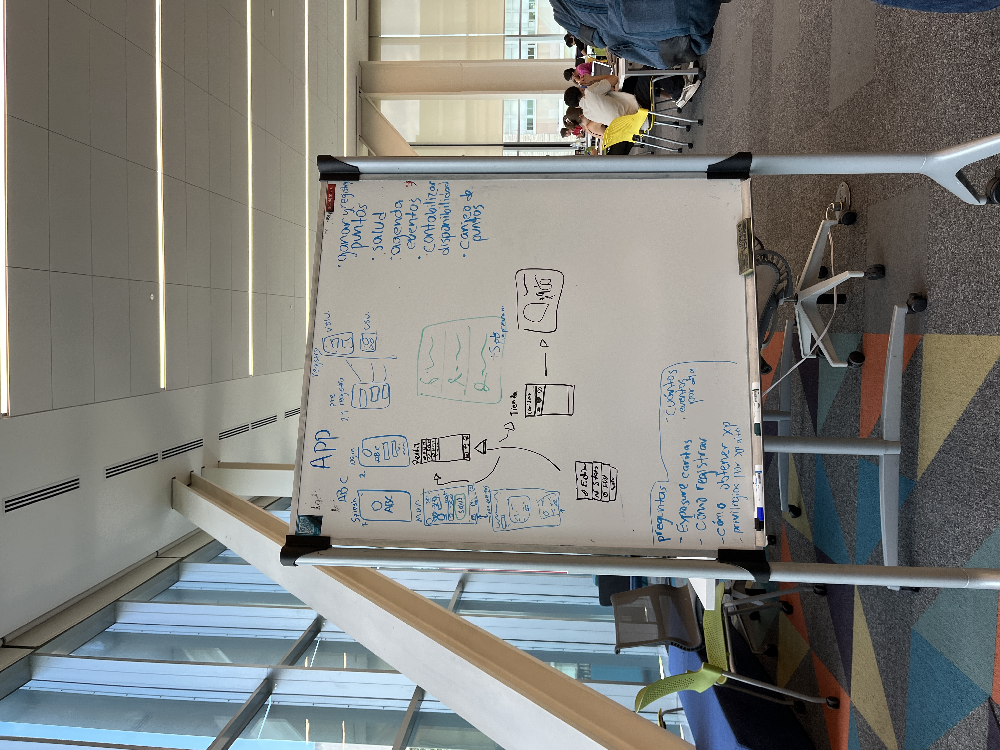

## Intro

Ricardo Núñez parte de TI de Cáritas

> Cáritas de Monterrey tienen la necesidad de contar con una App llevar el seguimiento del programa de salud para empleados y voluntarios de Cáritas.

Asociación de la iglesia y empresarios, 3k empleados

Departamento de casos es el más grande, busca ayuda médica, económica, +, espacio de donativos.

Muchos departamentos de banco de alimentos, salud, medicamentos, posadas, demás.

## App

Para los empleados de Cáritas, para el cuidado de salud, realización de retos a través del año para cuidar la salud. Para fomentar el interés sobre el programa, se realiza un portal web para monitorear el progreso y desbloquear beneficios a través de puntos ganados en la programa. Las actividades para ganar puntos ya se está estableciendo en Cáritas, que son como asistir a jornadas de salud (chequeos) y más.

Los beneficios más altos son días de vacaciones y bonos, los más sencillos son entradas a parques, días tarde, etc.

Para voluntarios y empleados, dos diferentes tipos de beneficios. Se busca que sea fácil registrar a las personas, pues así se podrían ofrecer los beneficios a personas voluntarias y no solamente a las personas ya con nómina en Cáritas.

- Para registrar los voluntarios se usa un correo y el departamento al que pertenecen.
- Las actividades para obtener puntos entre ambos son los mismos.

Que todos los datos que se ingresen en la aplicación se puedan obtener los datos, que se puedan sincronizar con los datos de su propio sistema.

Pase de lista

Usar un código QR o palabra clave como registro?

Las recompensas se pueden obtener mediante un email al correo registrado (por definir).

Al inicio, al entrar, un tablero grande para emocionarte.

El plan es que después de reclamar el premio los empleados o voluntarios se tienen que presentar con RH.

> Se puede desarrollar una manera de desplegar continuamente el contenido de la base de datos para que no hayan problemas de que alguien intente de desbloquear algo que le aparezca como disponible

## Notas de entrega 1

- Preguntar a JuanJo qué vamos a poner de seguridad.
- No poner requerimientos no funcionales de más solamente por ponerlos, solamente comprometernos a lo que nos piden y lo que debería de ser.
- Utilizar la paleta de colores que nos dieron para diseñar en Figma
- Requerimiento no funcional: La DB tiene que ser SQL Server 2008

## Reunión 1

Navbar

- Eventos
- Tienda
- Perfil

Pantallas:

1. Splash
2. Login
3. Pre-registro (voluntario y empleado):
   - Diferentes botones según el tipo de registro
4. Main
5. Eventos
6. Canjear
   - Historial de canjeo de recompensas
7. Perfil:

Pendiente por resolver:

- Nombre de la app
- Cómo hacer el pase de lista
- Streak de abrir la aplicación

Preguntas:

- Exposure caritas
- Cómo registrar
- Cómo obtener XP
- Privilegios por XP alto

Preguntas a Cáritas:

- Se espera que un administrador pueda accesar dentro de la misma aplicación para visualizar la interacción de los empleados / voluntarios? O los administradores accesarían por otro medio para registrar eventos, ver estadísticas, etc.?

